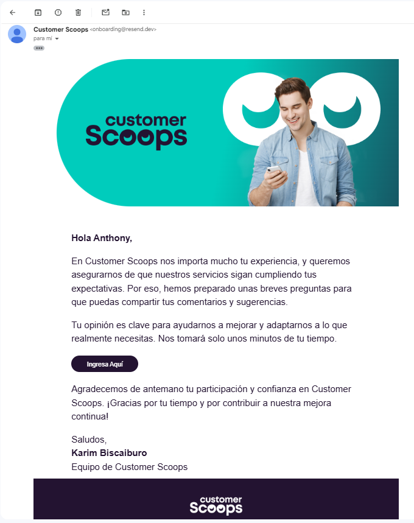

# Documentación

[Página Web](https://prueba-tecnica-customer-scoops.vercel.app/)

## Instrucciones

En primer lugar, y luego de clonar el repositorio, es necesario instalar las dependencias con `npm install`.

>[!WARNING]
>Requisito tener instalado "node".

 

Para visualizar la página basta con ejecutar `npm run dev`.

 

Por último, para probar el funcionamiento del envío del correo, debes ejecutar el comando `node ./server/index.js`;

>[!NOTE]
>Para evitar errores primero tenés que crearte una cuenta en [Resend](https://resend.com/), crear una API KEY, dentro de la carpeta /server agregá un documento ".env.local", en la primera línea escribir "RESEND_API_KEY=tu_api_key" y dentro de la función, reemplazar 'anthony@customerscoops.com' por tu email con el que te registraste.

## Estilos

Metodología BEM.

 

Algunos pequeños componentes poseen estilos agregados directamente en el componente o son "styled components". De esta manera se evita crear archivos con muy pocas líneas de código CSS.

>[!NOTE]
>Esto es útil en este caso porque los componentes tienen muy pocas probabilidades de escalar, y ayuda a la legibilidad.

 

En cuanto al diseño, intenté ser lo más fiel posible al diseño proporcionado en Figma para ajustarme a la consigna. Yo particularmente agrandaría algunas fuentes y tamaños de elementos, principalmente en dispositivos más grandes que un celular. 

## Funcionalidades

En cada sección del formulario se define una función que, además de avanzar a la sección siguiente, deja lugar para ejecutar algún código en caso de que se quiera, por ejemplo, guardar la opción seleccionada. Además, es indispensable que para continuar hacia el final, el usuario responda cada apartado.

## Envío de Correo 

Dentro de la carpeta /server/template se encuentra el HTML con el que fui maquetando y diseñando el formato del email. Este lo copié y pegué dentro de la función que envía el email.

 

Las imágenes del template son extraídas de un servicio (Cloudinary) donde las subí. Esto se debe a que al intentar usarlas por medio de la página desplegada, les agregaba un fondo y empeoraba la calidad.

 

También tuve que crear un asset nuevo, a partir de otros, para poder mantener el diseño en su totalidad. El motivo fue que muchos de los estilos necesarios para posicionar correctamente los elementos no eran procesados, así como también tuve que hacer los estilos en línea porque la etiqueta <style> provocaba errores.

 

>[!IMPORTANT]
>En lo que respecta a enviar el template al email proporcionado, tanto Resend como SendGrid solicitan validar un dominio para poder enviar a un correo que no sea el que usaste para registrarte. Por este motivo es que no pude completar el requisito, pero de todas formas adjunto una imagen para demostrar que se envía correctamente al Gmail.

 

